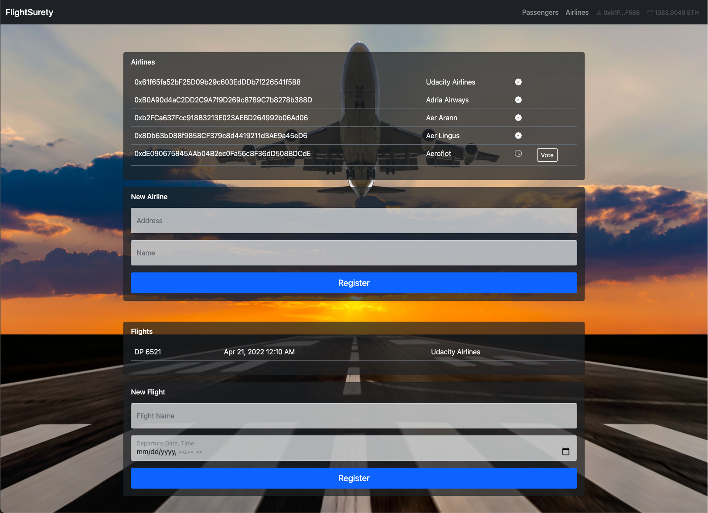
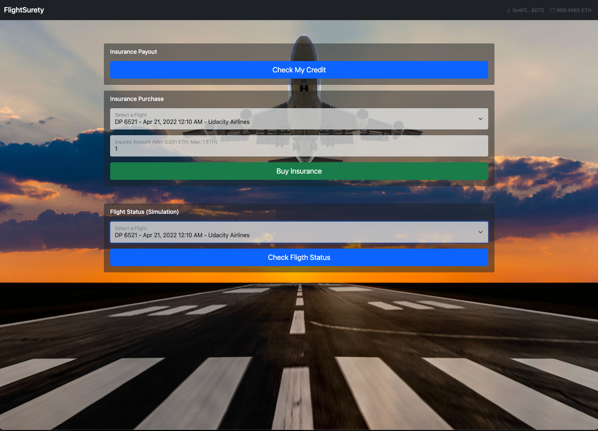

# FlightSurety

FlightSurety is a sample application based on smart contracts running on the Ethereum blockchain.

Passengers can purchase flight insurance, airlines can register new airlines and flights. 
Oracles simulate insurance case after which passenger can get a payout.

>This project was developed as part of Udacity's Blockchain Developer Nanodegree Program. 

## Install

- To install, download or clone repo, then:

`npm install`

- Install truffle:

`npm i -g truffle`

- Install ganache:

`npm i -g ganache`

- Launch ganache in a separate terminal with at least 40 accounts and the specified mnemonic:

`ganache -a 40 -m "cool alpha pact nasty salon duck teach web reject economy army donate"`

- Deploy contracts to ganache:

`truffle migrate --reset`

## Start the Server

To start the flight status simulation server:

`cd server`

`npm install`

`npm run dev`

You can check server status and simulating oralces number at [localhost:3000](http://localhost:3000).

## Start the dApp

To start the dApp run following commands in a separate terminal:

`cd dapp`

`npm install`

`npm run dev`

Open [localhost:8080](http://localhost:8080) in your browser.

## dApp Screenshots

Accounts registered as airline can register flights and new airlines. Registration of fifth and subsequent airlines requires multi-party consensus of 50% of registered airlines. So airline accounts can access the voting.

Passengers can purchase insurance, invoke the simulation of flight fault due airline company and then get a payout.

>Flights and airlines are statically programmed. The list with allowed for registration flights and airlines is printed in the developer console.

## Test contracts

To run truffle tests:

`truffle test`

## Environment used to develop

- Node v16.13.2
- Ganache v7.0.4
- Truffle v5.5.10
